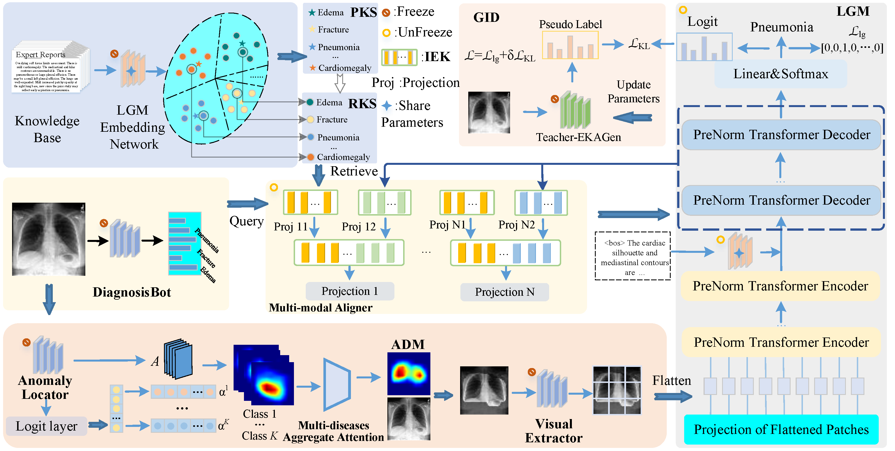

# EKAGen
Code for CVPR2024 paper: Instance-level Expert Knowledge and Aggregate Discriminative Attention for Radiology Report Generation

# Abstract
Automatic radiology report generation can provide substantial advantages to clinical physicians by effectively reducing their workload and improving efficiency. Despite the promising potential of current methods, challenges persist in effectively extracting and preventing degradation of prominent features, as well as enhancing attention on pivotal regions. In this paper, we propose an Instance-level Expert Knowledge and Aggregate Discriminative Attention framework for radiology report generation. We convert expert reports into an embedding space and generate comprehensive representations for each disease, which serve as Preliminary Knowledge Support (PKS). To prevent feature disruption, we select the representations in the embedding space with the smallest distances to PKS as Rectified Knowledge Support (RKS). Then, EKAGen diagnoses the diseases and retrieves knowledge from RKS, creating Instance-level Expert Knowledge (IEK) for each query image, boosting generation. Additionally, we introduce Aggregate Discriminative Attention Map (ADM), which uses weak supervision to create maps of discriminative regions that highlight pivotal regions. For training, we propose a Global Information Self-Distillation (GID) strategy, using an iteratively optimized model to distill global knowledge into EKAGen. Extensive experiments and analyses on IU X-Ray and MIMIC-CXR datasets demonstrate that EKAGen outperforms previous state-of-the-art methods.

<p align="center">
    
</p>

# Get Started

## 1) Requirement

- Python 3.8.13
- Pytorch 1.9.0
- torchvision 0.10.0
- CUDA 11.8
- NVIDIA RTX 4090

## 2) Data Preperation
### MIMIC-CXR
You must be a credential user defined in [PhysioNet](https://physionet.org/settings/credentialing/) to access the data.
Download chest X-rays from [MIMIC-CXR-JPG](https://physionet.org/content/mimic-cxr-jpg/2.0.0/) and reports from [MIMIC-CXR-JPG](https://physionet.org/content/mimic-cxr/2.0.0/) Database. You can also download the processed report for MIMIC-CXR by [Chen *et al.*](https://aclanthology.org/2020.emnlp-main.112.pdf) from [R2GenCMN](https://github.com/cuhksz-nlp/R2GenCMN).

Weights and knowledge base data can be downloaded from [Hugging Face](https://huggingface.co/ShenshenBu/EKAGen).

## Citation

If you find this work useful in your research, please cite:
```tex
@InProceedings{Bu_2024_CVPR,
    author    = {Bu, Shenshen and Li, Taiji and Yang, Yuedong and Dai, Zhiming},
    title     = {Instance-level Expert Knowledge and Aggregate Discriminative Attention for Radiology Report Generation},
    booktitle = {Proceedings of the IEEE/CVF Conference on Computer Vision and Pattern Recognition (CVPR)},
    month     = {June},
    year      = {2024},
    pages     = {14194-14204}
}
```
